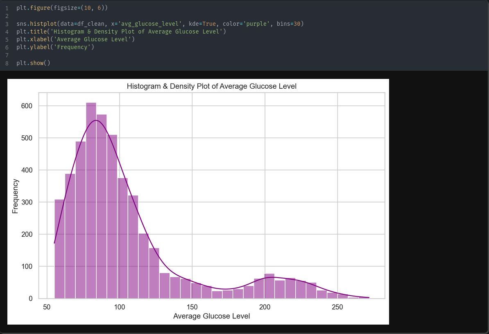
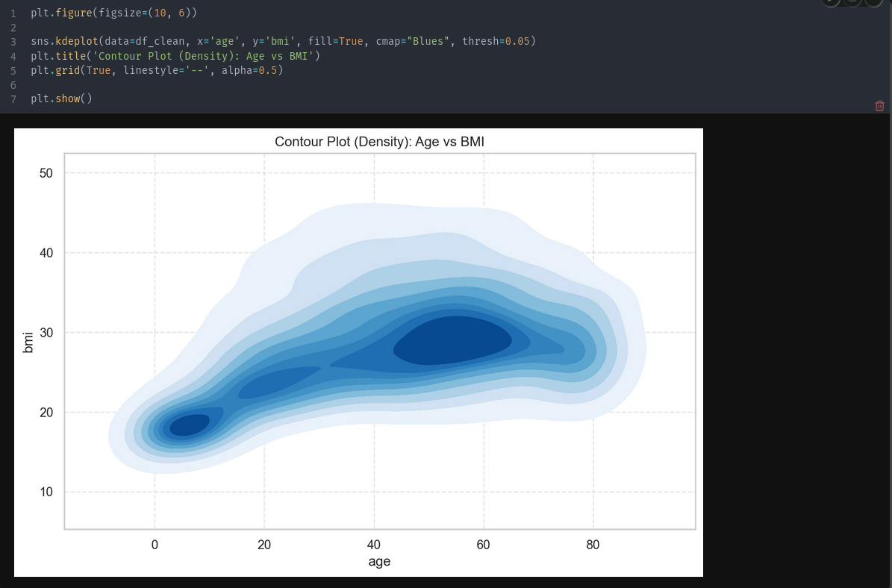
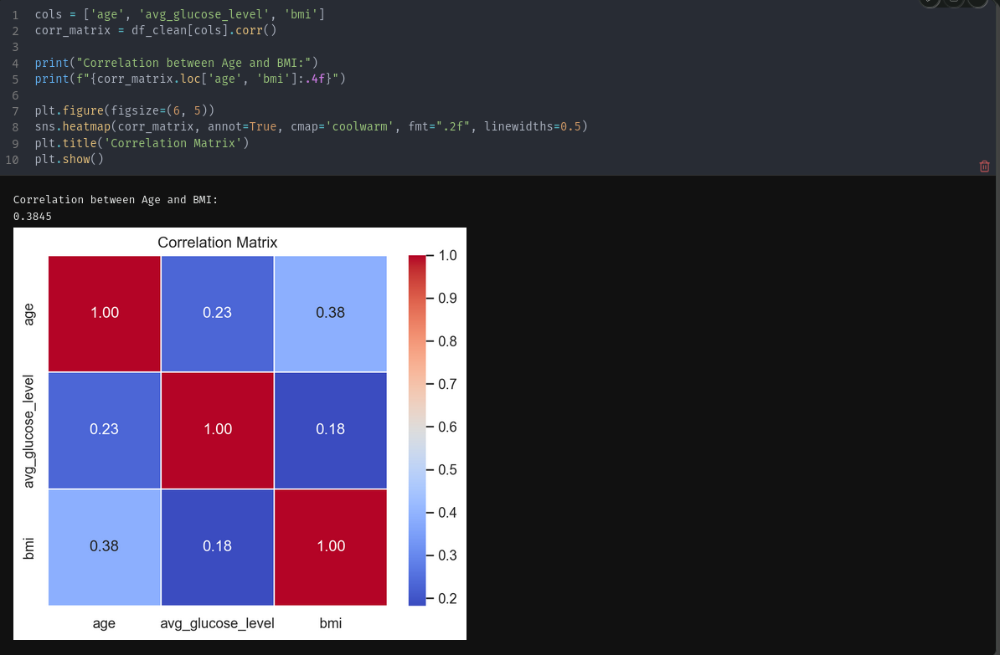
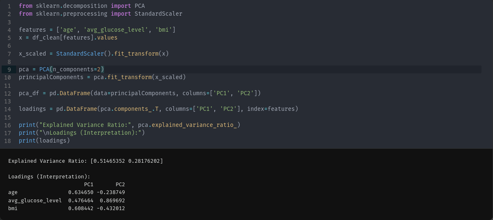
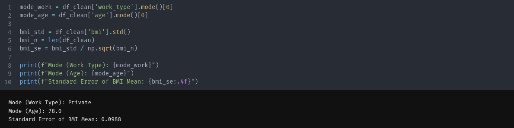
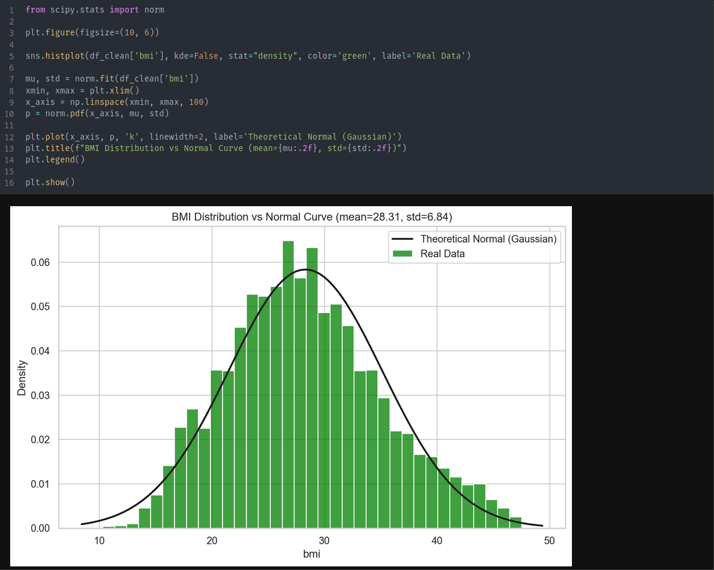
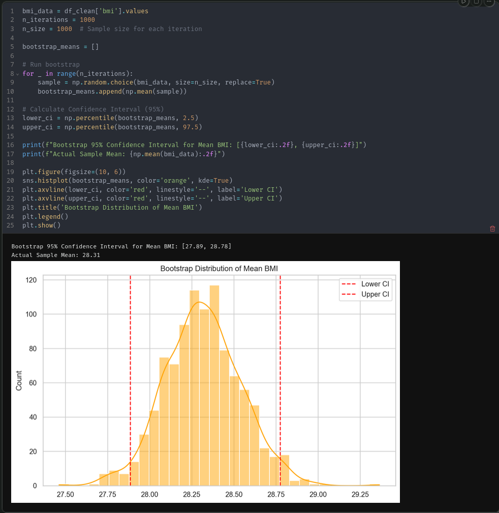

## Запуск

Цей проект використовує пакетний менеджер **[uv](https://docs.astral.sh/uv/)**.

Для налаштування оточення та запуску виконайте:

```bash
uv sync
uv run marimo edit main_nb.py
```

# Лабораторна робота №6: Оцінки розподілу даних

**Мета:** Провести статистичний аналіз даних (візуалізація, кореляція, PCA, бутстрап) на основі датасету `Stroke Prediction Dataset`.

## 1. Візуалізація даних

### 1.1. Коробчаста діаграма та Скрипковий графік (BMI)


* **Boxplot:** Чітко показує медіану BMI близько **28**. "Вуса" діаграми охоплюють основну масу людей, але ми бачимо багато точок зверху — це викиди (люди з ожирінням > 45).
* **Violin Plot:** Показує форму розподілу BMI для людей, які мали інсульт (Stroke=1), і тих, хто не мав (Stroke=0). У групи з інсультом "живіт" скрипки (найширша частина) розташований вище, що вказує на тенденцію до вищої ваги серед пацієнтів з інсультом.

### 1.2. Гістограма та Графік густини (Glucose)



* Розподіл рівня глюкози (`avg_glucose_level`) **бімодальний** (має два горби).
* Основний пік: ~80-100 (здорові люди).
* Другий менший пік: ~200+ (люди з діабетом).
* Це важлива знахідка: середнє значення тут не є показовим, бо воно потрапляє між двома групами.

### 1.3. Контурний графік (Age vs BMI)



* Графік показує густину розподілу популяції в координатах віку та ваги.
* Ми бачимо найтемнішу синю пляму (найбільше скупчення людей) у віці **40-60 років** з BMI **25-35**. Це "типовий пацієнт" у нашому наборі даних.

---

## 2. Кореляційний аналіз

Ми розрахували кореляційну матрицю для числових змінних:



| Змінна 1 | Змінна 2 | Коефіцієнт | Інтерпретація |
| :--- | :--- | :--- | :--- |
| **Age** | **BMI** | **0.38** | Помірна позитивна. З віком вага схильна зростати. |
| **Age** | **Glucose** | **0.24** | Слабка позитивна. Ризик діабету зростає з віком. |
| **BMI** | **Glucose** | **0.18** | Дуже слабка. Висока вага не гарантує високий цукор. |

**Висновок:** Змінні слабо залежать одна від одної лінійно. Це означає, що інсульт спричиняється складною комбінацією факторів, а не просто "зайвою вагою".

---

## 3. Метод головних компонент (PCA)

Ми стиснули 3 змінні (`age`, `bmi`, `glucose`) у 2 головні компоненти, які пояснюють **~79%** інформації.



**Інтерпретація компонент (Loadings):**

1. **PC1 (51% дисперсії):** Має високі коефіцієнти для `Age` та `BMI`.
    * *Сенс:* Це **"Фактор вікового ожиріння"**. Він розрізняє молодих/худих від літніх/повних.
2. **PC2 (28% дисперсії):** Має дуже високий коефіцієнт для `Glucose`, але від’ємний для `BMI`.
    * *Сенс:* Це **"Метаболічний фактор"**. Він виділяє людей, які мають високий цукор, але не обов'язково високу вагу (наприклад, діабет 1 типу або генетична схильність).

---

## 4. Статистичні оцінки



1. **Мода:**
    * Найчастіший тип роботи: `Private` (Приватний сектор).
    * Найчастіший вік: `78 років` (Це пояснюється специфікою датасету інсультів — тут багато літніх людей).
2. **Стандартна похибка (Standard Error) для BMI:**
    * Значення: `0.0988`.
    * Це свідчить про високу точність нашої оцінки середнього, оскільки вибірка велика (~4900 записів).

---

## 5. Оцінка розподілу

Ми порівняли розподіл **BMI** з ідеальною кривою Гауса.



* Гістограма майже ідеально накладається на дзвоноподібну криву (чорна лінія).
* Присутня невелика асиметрія праворуч (right skew).
* **Висновок:** Розподіл є **Гаусовським (Нормальним)**.

---

## 6. Бутстрап (Bootstrap)

Для оцінки істинного середнього значення BMI ми згенерували 1000 підвибірок.



* **Фактичне середнє вибірки:** `28.31`
* **95% Довірчий інтервал:** `[27.89, 28.78]`

**Висновок:** Ми можемо з 95% впевненістю стверджувати, що середній індекс маси тіла у генеральній сукупності (серед усіх подібних пацієнтів) лежить у межах від 27.89 до 28.78. Вузький інтервал підтверджує репрезентативність нашої вибірки.
